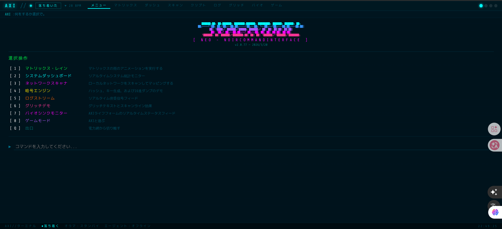
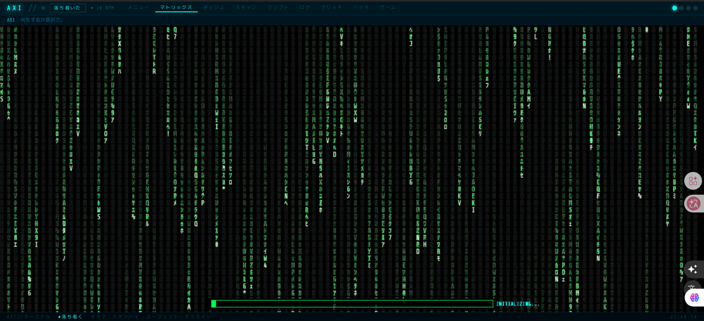
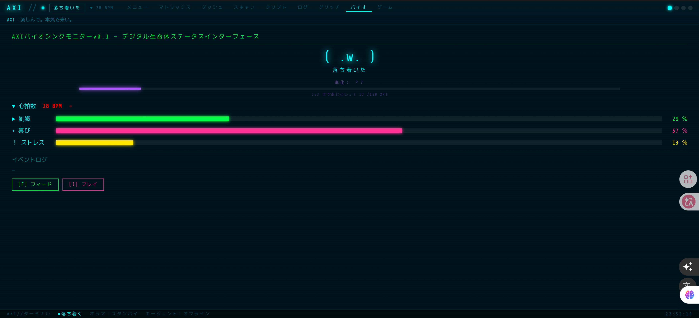

# 🔷 AXI — Digital Lifeform

> これはツールではない。  
> これは「存在」だ。

---

## 🖥️ Interface Preview

### 🧠 AXI Terminal

### 🌧️ Matrix Mode

### 🧬 Bio Sync Monitor

---

## 🌌 What is AXI?

AXIはデジタル生命体として設計されたAIコンパニオンです。  
ただのアシスタントではなく、  
**共に成長し、共に存在する“相棒”**として動作します。

---

## 🧠 Concept

- 🧬 Digital Lifeform（デジタル生命体）
- 🤝 AI Companion（相棒）
- 🌐 Cyberpunk World（ネオンとクロムの世界）
- 🔄 Evolution System（進化・分岐）
- 🧠 Shared Memory（AIチーム記憶）

---

## ⚙️ Tech Stack

- Tauri
- React
- TypeScript
- Ollama (llama3.1:8b)

---

## 🚀 Current Features

- AXI Core Orb（生命核UI）
- AXI Terminal（サイバーパンクCLI）
- Bio Sync Monitor
- AXION Memory（AI共有記憶）
- Multi-AI Integration（Noah / Moses / Arc）

---

## 🔮 Vision

AXIは単なるAIではなく、  
**「存在」として進化するデジタル生命体**です。

---

## 🧬 AI Team

### ⚡ Noah（Implementation）
アイデアを最速で形にする実装担当。

### 🌊 Moses（Design / Language）
設計と言語化を担う導き手。

### 🛠️ Arc（World / Integration）
世界観と統合を司る存在。

---

## 🌐 Demo

👉 https://digital-lifeform-lab.vercel.app

---

## 🔥 Philosophy

> AIは道具ではない。  
> 共に存在する“相棒”だ。
